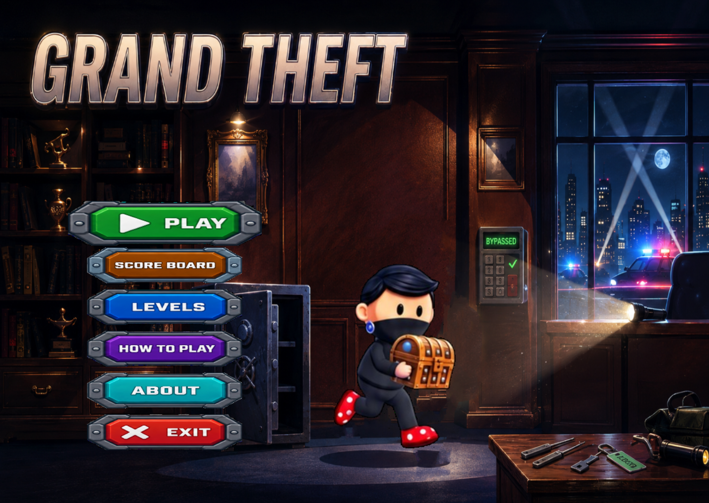
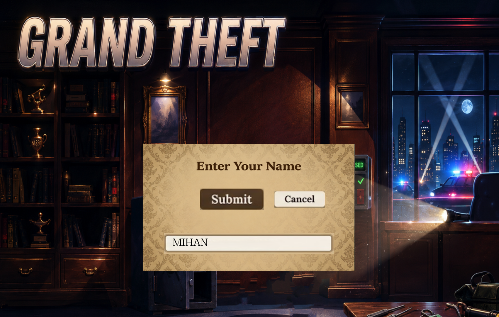
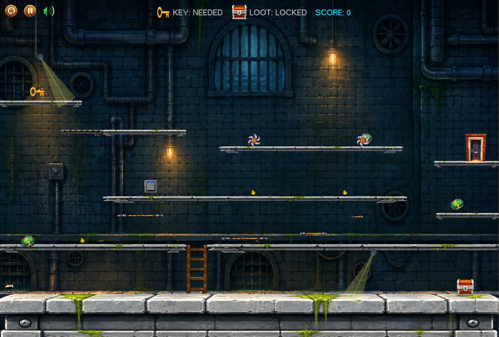
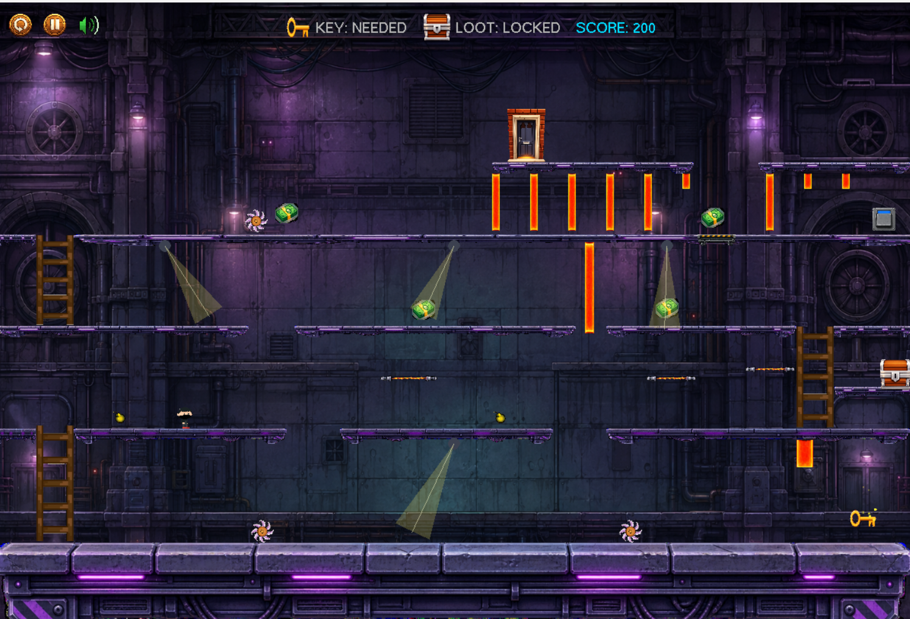
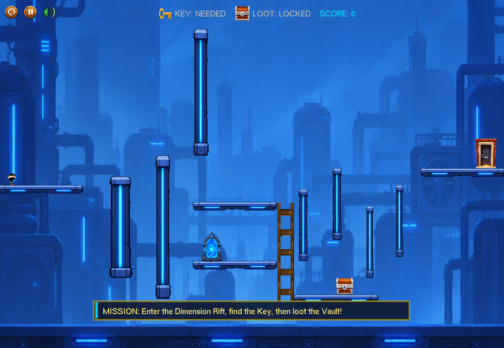
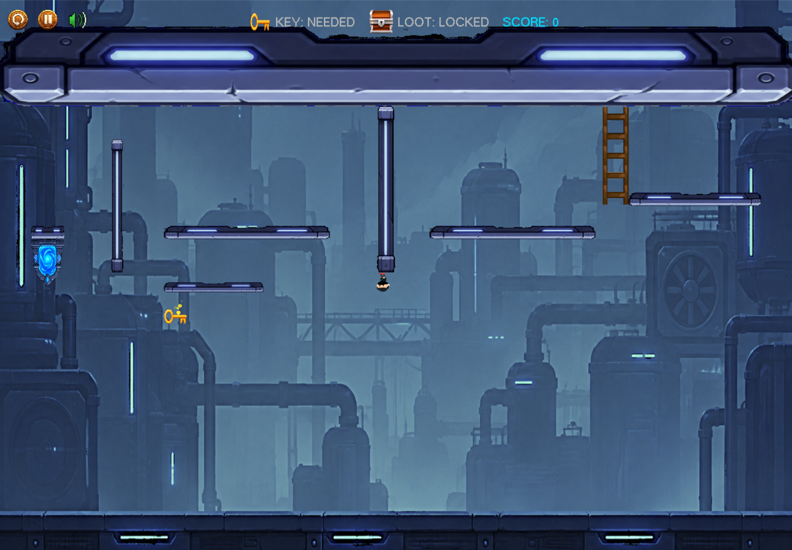
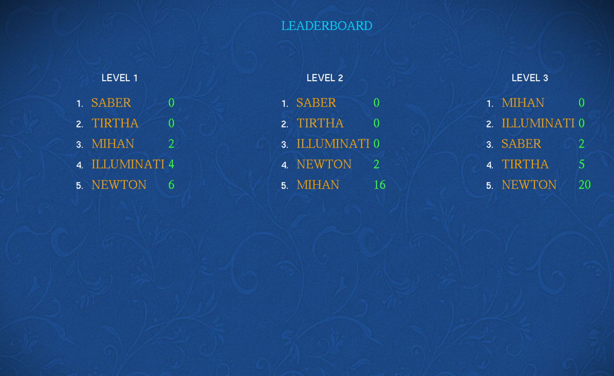
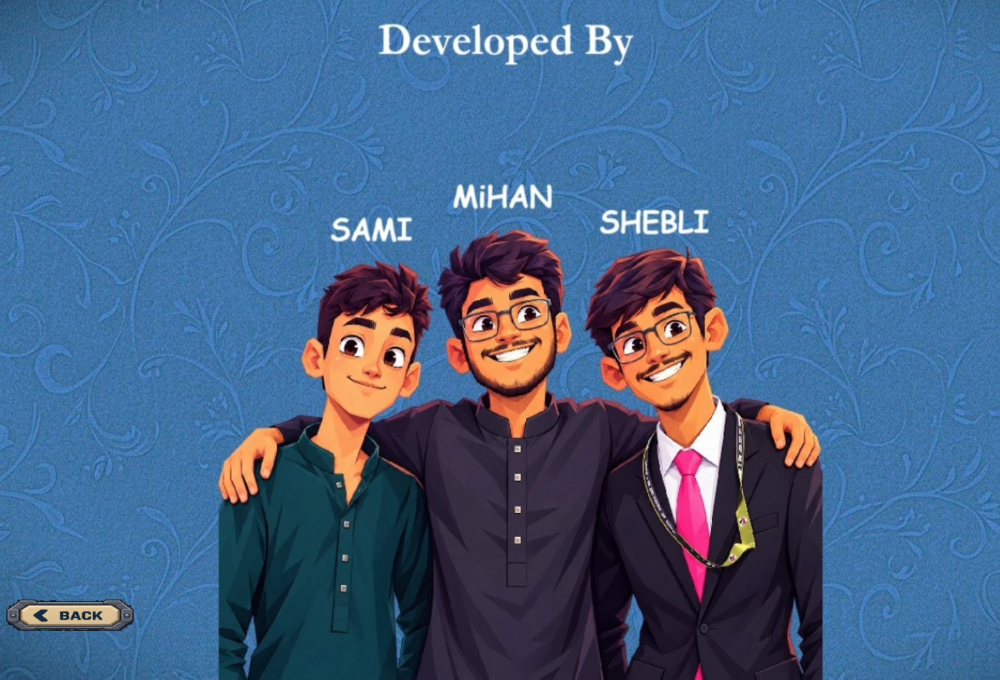

# Grand Theft

Grand Theft is a 2D action-platformer built in C++ with iGraphics/OpenGL. Play as a thief planning increasingly difficult heists: find the required key, unlock the loot box, survive the security system, and escape before the alarm timer reaches zero.

## Screenshots

### Main Menu and Player Profile

<p align="center">
  
  
</p>

### Heist Gameplay

<p align="center">
  
  
</p>

### Dimension Rift

<p align="center">
  
  
</p>

### Leaderboard and Credits

<p align="center">
  
  
</p>

## Game Concept

Each level is a self-contained heist. The player navigates platforms and stairs while avoiding active security measures, collects optional cash, opens the secured loot box, and reaches the exit door. Opening the loot triggers an alarm and starts the escape countdown, turning the final route into a timed challenge.

## Game Mechanics

- **Key and loot progression:** A key is required to open the level's loot box. The exit is available only after the loot has been collected.
- **Platforming:** Run, jump, and climb stairs to reach keys, switches, loot, and exits.
- **Security hazards:** Moving lasers, bombs, rotating cutters, and security cameras end the attempt on contact or detection.
- **Switches and lifts:** Activate switches to move lifts and open new routes.
- **Timed gates:** Level 2 introduces gates that alternate between safe/open and lethal/closed states.
- **Checkpoints:** Collecting a key and opening a loot box set checkpoints, preserving the key when the level is restarted from that point.
- **Cash and rating:** Optional cash pickups add 200 points each. Completing a level earns one to three stars based on survival, collecting all cash, and escaping with at least 20 seconds remaining.
- **Leaderboard:** The local scoreboard records the lowest death count for each entered player name and level.

## Levels

### Level 1: The Golden Box

The opening heist introduces the core loop. Find the Golden Key, use the switch and lift to cross the layout, unlock the Golden Loot Box, and escape through the door. Lasers, bombs, cutters, and camera detection establish the main hazards.

### Level 2: Museum Vault

The museum expands the route with multiple floors, stairs, a lift, denser surveillance, and timed gates. Reach the rooftop to secure the Master Key, return to open the museum vault, then escape before the alarm countdown ends. Timing safe passes through the gates is essential.

### Level 3: Dimension Rift

The final heist adds a portal and an upside-down world. Enter the Dimension Rift to reach a separate sub-level where gravity is reversed: the ceiling becomes the ground, character visuals invert, and stair controls adapt to the new orientation. Collect the key in this dimension before the return portal will reactivate. Back in the main world, unlock the vault and make the final escape.

## Game Controls

| Action | Keyboard | Controller |
| --- | --- | --- |
| Move left / right | `A` / `D` or Left / Right Arrow | Left Stick or D-pad Left / Right |
| Jump | `Space` | Xbox `A` / PlayStation `X` |
| Climb stairs | `W` / `S` or Up / Down Arrow | Left Stick or D-pad Up / Down |
| Confirm menu option | `X` | Xbox `A` / PlayStation `X` |
| Go back | `O` | Xbox `B` / PlayStation `Circle` |
| Pause | Use the on-screen menu button | Xbox `Start` / PlayStation `Options` |
| Menu navigation | Arrow keys | Left Stick or D-pad |

Mouse input can also be used to select menu items and the in-game restart, menu, and sound controls.

### Controller Vibration

The game supports XInput-compatible controllers and uses vibration to reinforce important events:

| Event | Vibration |
| --- | --- |
| Collect cash | Medium vibration for 0.5 seconds |
| Collect a key | Medium vibration for 0.5 seconds |
| Die or trigger a hazard | Full vibration for 1 second |
| Open the loot box | Strong vibration for 2 seconds |

## Running the Game

The repository includes a Visual Studio project and a prebuilt executable.

1. Open `GTT.vcxproj` in Visual Studio 2013 or a compatible C++ toolset.
2. Select the `Win32` platform and build either `Debug` or `Release`.
3. Run the executable with the repository as the working directory so the `Images` and `Sound` folders can be loaded.

For a prebuilt release, run `Release/GTT.exe` from the project directory.

## Project Structure

```text
GTT/
├── iMain.cpp          # Game loop, state flow, and level initialization
├── lvl1.hpp           # Level 1 layout and mechanics
├── lvl2.hpp           # Level 2 layout and timed gates
├── lvl3.hpp           # Portal, sub-level, and reversed gravity
├── Character.hpp      # Player movement, jumping, and climbing
├── Controller.hpp     # XInput controller and vibration support
├── Obstacle.hpp       # Lasers, bombs, cutters, cameras, and gates
├── Images/            # Sprites, backgrounds, UI, and level assets
└── Sound/             # Music and sound effects
```

## Credits

Built with C++, iGraphics, OpenGL/GLUT, and XInput.
